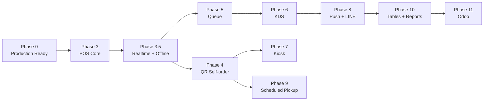

# Aevo POS — Full Implementation Plan (Phase 0 → Phase 11)

แผนพัฒนาละเอียดสำหรับ Aevo Store Operations Platform จาก production readiness ไปจนถึง reporting/integration ครบทุก Phase

---

## สถานะปัจจุบัน (Baseline)

| Layer | มีแล้ว |
|---|---|
| **Infra** | Cloudflare Worker + Astro static + Elysia API, Supabase Auth + PostgreSQL (RLS), CI on GitHub Actions |
| **Auth** | Login/logout, HttpOnly cookie, session resolve, RBAC, rate limiter |
| **Catalog** | Categories, products, variants, menus, menu items, modifier groups, availability, sold-out, atomic PATCH |
| **Orders** | Unified `orders` aggregate, items+modifiers snapshots, per-store order number, create/transition/payment RPCs, idempotency, domain outbox |
| **UI** | Login, store selector, workspace, catalog management, order list (read-only) |

---

## Phase 0 — Production Readiness

> **เป้าหมาย**: Worker deploy ได้ไม่พัง, login ทำงาน, seed admin ผ่าน, CI green

### 0.1 แก้ Worker binding

**ปัญหา**: ถ้ามี binding mismatch ระหว่าง `wrangler.jsonc` กับ code

#### [MODIFY] [wrangler.jsonc](file:///Users/jayc/Project/aevo-pos/wrangler.jsonc)
- ตรวจสอบว่า `main` ชี้ถูกที่ `./apps/worker/src/index.ts`
- ตรวจสอบ `assets.binding` = `"ASSETS"` ตรงกับ `WorkerEnv.ASSETS`
- เพิ่ม `[vars]` section ถ้าจำเป็นสำหรับ non-secret values

#### [MODIFY] [index.ts](file:///Users/jayc/Project/aevo-pos/apps/worker/src/index.ts)
- ตรวจสอบว่า `WorkerEnv` interface ครอบคลุม binding ทุกตัว
- Verify `ASSETS` binding type ตรงกับ Cloudflare Workers Assets API

**ทดสอบ**:
```bash
bun run build
npx --yes wrangler@4.132.0 deploy --dry-run --config wrangler.jsonc
```

### 0.2 ทดสอบ /ready

```bash
# Local
curl -s http://localhost:3001/ready | jq .
# Expected: { "status": "ready", "requestId": "..." }

# Production (after deploy)
curl -s https://<worker>.workers.dev/ready | jq .
```

- ถ้า 503 → ตรวจ Worker env vars (`SUPABASE_URL`, `SUPABASE_SECRET_KEY`, `WEB_ORIGIN`)
- ถ้า timeout → ตรวจ Supabase project paused/network

### 0.3 ทดสอบ login

```bash
curl -s -X POST http://localhost:3001/api/auth/login \
  -H 'content-type: application/json' \
  -H 'origin: http://localhost:4321' \
  -d '{"email":"owner@example.com","password":"change-me-now"}' \
  -D - -o /dev/null
# Expected: 204 + set-cookie header
```

- ตรวจ cookie name = `aevo_session`
- ตรวจ `HttpOnly; SameSite=Lax; Path=/`
- Production ต้องมี `Secure`

### 0.4 ทดสอบ /api/auth/me

```bash
curl -s http://localhost:3001/api/auth/me \
  -H 'cookie: aevo_session=<cookie-value>' | jq .
# Expected: { "user": { "userId": "...", "role": "OWNER", ... } }
```

### 0.5 รัน seed admin

```bash
cp .env.example .env
# แก้ SUPABASE_URL, SUPABASE_SECRET_KEY, SEED_* values
bun install
bun run db:seed
```

- Verify ใน Supabase Dashboard: Auth → Users → เห็น seed email
- Verify: profiles, organizations, stores, memberships ถูกสร้าง

### 0.6 เปิด Supabase leaked-password protection

1. เข้า Supabase Dashboard → Authentication → Providers → Email
2. เปิด "Password protection" / "Leaked password protection" (HaveIBeenPwned)
3. ตรวจสอบว่า sign-up ด้วย password ที่ leak จะถูก reject

### 0.7 รัน CI ซ้ำบน main

```bash
bun run typecheck
bun test packages apps
bun run build
```

- Push to `main` → ดู GitHub Actions ว่า green
- ถ้า fail ให้แก้จนผ่านก่อนเริ่ม Phase 3

---

## Phase 3 — POS

> **Exit criteria**: ร้านสามารถขายสินค้าและรับเงินสดผ่านมือถือหรือแท็บเล็ตได้

### Architecture Overview

```text
┌─────────────────────────────────────────────┐
│  /staff/pos?store={storeId}                 │
│  ┌─────────────┐  ┌───────────────────────┐ │
│  │ Category    │  │   Product Grid        │ │
│  │ Sidebar     │  │   (touch-friendly)    │ │
│  │             │  │                       │ │
│  │ ☰ All       │  │  ┌───┐ ┌───┐ ┌───┐   │ │
│  │ ☕ Coffee    │  │  │ A │ │ B │ │ C │   │ │
│  │ 🧁 Bakery   │  │  └───┘ └───┘ └───┘   │ │
│  │ 🥤 Drinks   │  │  ┌───┐ ┌───┐ ┌───┐   │ │
│  │             │  │  │ D │ │ E │ │ F │   │ │
│  └─────────────┘  │  └───┘ └───┘ └───┘   │ │
│                   └───────────────────────┘ │
│  ┌──────────────────────────────────────────┤
│  │  Cart Panel (slide-up on mobile)        ││
│  │  ┌────────────────────────────────────┐ ││
│  │  │ Latte (Hot, L) × 2    ฿130.00     │ ││
│  │  │  + Oat Milk  ฿20.00               │ ││
│  │  │ Croissant × 1         ฿85.00      │ ││
│  │  ├────────────────────────────────────┤ ││
│  │  │ Subtotal:              ฿365.00     │ ││
│  │  │ [Takeaway ▾] [Customer: optional]  │ ││
│  │  │ [🔒 Hold] [💰 Cash ฿365.00]       │ ││
│  │  └────────────────────────────────────┘ ││
│  └──────────────────────────────────────────┤
└─────────────────────────────────────────────┘
```

### 3.1 Product/Category Grid

#### [NEW] `apps/web/src/pages/staff/pos.astro`

**Layout**: 2-panel (tablet) / single-column with bottom sheet (phone)
- **Left sidebar / top tabs**: Category list จาก catalog API
  - "ทั้งหมด" tab แสดงทุก product
  - แต่ละ category tab กรอง products ตาม `categoryId`
- **Main area**: Product grid
  - Touch-friendly card ≥ 60×60px
  - แสดง: name, base price (formatted), sold-out badge
  - Tap → ถ้ามี variant/modifier → เปิด modifier modal, ถ้าไม่มี → เพิ่มเข้า cart ทันที

**Data flow**:
```
Page load → GET /api/catalog?storeId={id}
         → CatalogSnapshot { categories, products, menus, modifierGroups }
         → กรองเฉพาะ products ที่ availability[channel=POS].isAvailable && !soldOut
         → Render grid
```

#### [NEW] `apps/web/src/lib/pos-store.ts` — Client-side cart state

```typescript
interface CartItem {
  id: string;                    // client-generated UUID
  productId: string;
  variantId?: string;
  menuItemId?: string;
  modifierIds: string[];
  productName: string;
  variantName?: string;
  modifierNames: string[];       // for display
  unitPriceMinor: number;        // base + variant delta
  modifierPriceMinor: number;    // sum of modifier deltas
  quantity: number;
  note: string;
}

interface Cart {
  items: CartItem[];
  fulfillmentType: 'TAKEAWAY' | 'DINE_IN';
  customerName: string;
  customerPhone: string;
  notes: string;
}
```

- Pure functions: `addItem()`, `removeItem()`, `updateQuantity()`, `clearCart()`
- Pricing via `@aevo/ordering` → `calculateOrderTotals()` client-side (for display)
- Actual total calculated server-side in `create_order` RPC

### 3.2 Cart

**Desktop/Tablet**: Right sidebar panel, always visible
**Phone**: Bottom bar สรุปจำนวนและยอดรวม, tap → slide-up full cart

- แสดงแต่ละ `CartItem` พร้อม:
  - Product name + variant name
  - Modifier list (indented)
  - Quantity stepper (−/+)
  - Line total
  - Swipe-to-delete หรือ ✕ button
- Footer:
  - Subtotal
  - Fulfillment type toggle (Takeaway/Dine-in)
  - Customer name (optional text input)
  - Note field (optional)
  - Hold / Cash buttons

### 3.3 Modifier Selection

#### [NEW] `apps/web/src/components/ModifierModal.ts` (vanilla JS web component หรือ inline script)

- เปิดเมื่อ product มี modifier groups ผูกอยู่
- สำหรับแต่ละ modifier group:
  - `SINGLE` → radio buttons
  - `MULTIPLE` → checkboxes (min/max validation)
  - `required: true` → ต้องเลือกอย่างน้อย `minSelections` ตัว
- แสดง price delta (+฿20, +฿0)
- ปุ่ม "เพิ่มลงตะกร้า" — disabled จนกว่า required groups จะเลือกครบ

> [!IMPORTANT]
> **ปัญหาปัจจุบัน**: Catalog API คืน `modifierGroups` แยกจาก products — ไม่มี mapping บอกว่า product ไหนใช้ modifier group ไหน

**ทางแก้ — Migration ใหม่**:

#### [NEW] `supabase/migrations/20260917XXXXXX_product_modifier_groups.sql`

```sql
-- Junction table: product ↔ modifier_group
CREATE TABLE IF NOT EXISTS public.product_modifier_groups (
  organization_id uuid NOT NULL REFERENCES public.organizations(id) ON DELETE CASCADE,
  product_id uuid NOT NULL,
  modifier_group_id uuid NOT NULL,
  sort_order integer NOT NULL DEFAULT 0,
  PRIMARY KEY (organization_id, product_id, modifier_group_id),
  FOREIGN KEY (organization_id, product_id)
    REFERENCES public.products(organization_id, id) ON DELETE CASCADE,
  FOREIGN KEY (organization_id, modifier_group_id)
    REFERENCES public.modifier_groups(organization_id, id) ON DELETE CASCADE
);

ALTER TABLE public.product_modifier_groups ENABLE ROW LEVEL SECURITY;

CREATE POLICY "org_member_read_product_modifier_groups"
  ON public.product_modifier_groups FOR SELECT
  USING (private.is_org_member(organization_id));

CREATE POLICY "org_catalog_manage_product_modifier_groups"
  ON public.product_modifier_groups FOR ALL
  USING (private.has_org_permission(organization_id, 'catalog.manage'));
```

#### [MODIFY] [catalog.ts](file:///Users/jayc/Project/aevo-pos/packages/db/src/catalog.ts)
- เพิ่ม query `product_modifier_groups` ใน `listCatalog()`
- Return เป็น `Map<productId, modifierGroupId[]>` ใน `CatalogSnapshot`

#### [MODIFY] [index.ts](file:///Users/jayc/Project/aevo-pos/packages/contracts/src/index.ts)
- เพิ่ม field `productModifierGroups: ProductModifierGroupMapping[]` ใน `CatalogSnapshot`
- ```typescript
  interface ProductModifierGroupMapping {
    productId: string;
    modifierGroupId: string;
    sortOrder: number;
  }
  ```

#### [MODIFY] [app.ts](file:///Users/jayc/Project/aevo-pos/apps/api/src/app.ts)
- เพิ่ม API: `POST /api/catalog/product-modifier-groups` — ผูก product กับ modifier group
  - Body: `{ storeId, productId, modifierGroupId }`
  - Permission: `catalog.manage`

### 3.4 Customer (Optional)

- Input field ใน cart footer: "ชื่อลูกค้า (ไม่จำเป็น)"
- เบอร์โทร optional
- ส่งเป็น `customerName`, `customerPhone` ใน `CreateOrderInput`
- ไม่ block checkout ถ้าเว้นว่าง

### 3.5 Takeaway / Dine-in

- Toggle button 2 ตัว ใน cart: **ซื้อกลับ** | **ทานที่ร้าน**
- Default = `TAKEAWAY`
- Maps to `CreateOrderInput.fulfillmentType`

### 3.6 Cash Payment

**Flow**:
```
1. กด [💰 ชำระเงินสด ฿365.00]
2. → Modal "รับเงินสด"
     - แสดงยอดที่ต้องชำระ: ฿365.00
     - Input: จำนวนเงินที่รับ (default = ยอดเต็ม)
     - Quick amount buttons: ฿500, ฿1000, exact
     - แสดงเงินทอน: ฿135.00
     - ปุ่ม "ยืนยัน"
3. → POST /api/orders  (Idempotency-Key: client-generated UUID)
     Body: CreateOrderInput (channel: "POS", fulfillmentType, items, customer...)
4. → POST /api/orders/{orderId}/payments (Idempotency-Key: another UUID)
     Body: { storeId, method: "CASH", amountMinor: 36500 }
5. → POST /api/orders/{orderId}/transition (Idempotency-Key: another UUID)
     Body: { storeId, toStatus: "CONFIRMED" }
6. → แสดง receipt (ดู 3.9)
7. → Clear cart
```

> [!NOTE]
> Order สร้างเป็น `DRAFT` → จ่ายเงิน → transition เป็น `PAID` (อัตโนมัติโดย payment RPC) → transition เป็น `CONFIRMED`
> ใช้ 3 API calls เรียงกัน ทุกตัวมี idempotency key ของตัวเอง

#### [MODIFY] [api.ts](file:///Users/jayc/Project/aevo-pos/apps/web/src/lib/api.ts)
- เพิ่ม helper `apiWithIdempotency<T>(path, init, body)` ที่ auto-generate `Idempotency-Key` header

### 3.7 Hold/Retrieve Order

**Hold flow**:
1. กด [🔒 Hold]
2. → `POST /api/orders` (channel: POS, status ยังเป็น DRAFT)
3. → ไม่ทำ payment, ไม่ transition
4. → Clear cart, แสดง toast "Order #SO-20260917-00001 held"

**Retrieve flow**:
1. กด icon 📋 ที่ top bar → แสดงรายการ DRAFT orders
2. → `GET /api/orders?storeId={id}&status=DRAFT`
3. → เลือก order → load order detail
4. → Map `OrderSummary.items` กลับเป็น `CartItem[]` (ใช้ catalog data สำหรับ modifier names)
5. → เปิด cart พร้อม items, กด checkout ตามปกติ

> [!WARNING]
> เมื่อ retrieve → ต้อง transition order เดิมเป็น `CANCELLED` แล้วสร้างใหม่ **หรือ** ใช้ order เดิมตรง ๆ (แต่ปัจจุบัน `create_order` RPC สร้าง items ในตัว ไม่มี API แก้ไข items)
>
> **ทางเลือก**: สำหรับ Phase 3 ใช้วิธี "Cancel + Re-create" เมื่อ retrieve มีการแก้ cart ก่อน checkout, ถ้า checkout ตรง ๆ ก็ใช้ order ID เดิม

### 3.8 Order History

- Tab/section ใน POS page หรือ link ไปหน้า orders ที่มีอยู่แล้ว
- แสดง orders วันนี้ (filter by date client-side หรือเพิ่ม query param)
- สำหรับ Phase 3 ใช้หน้า `/staff/orders` ที่มีอยู่ + เพิ่ม link กลับ POS

### 3.9 Receipt View

#### [NEW] `apps/web/src/components/receipt.ts` (หรือ inline ใน pos.astro)

- แสดงเป็น modal หลัง checkout สำเร็จ
- Content:
  ```
  ═══════════════════════
       [Store Name]
     [Store Address]
  ═══════════════════════
  Order: SO-20260917-00001
  Date:  17/09/2026 09:30
  Cashier: owner@example.com
  Type: ซื้อกลับ
  ───────────────────────
  Latte (Hot, L) × 2
    + Oat Milk            ฿20
                    ฿290.00
  Croissant × 1    ฿85.00
  ───────────────────────
  Subtotal:        ฿375.00
  Total:           ฿375.00
  Cash:            ฿500.00
  Change:          ฿125.00
  ═══════════════════════
     ขอบคุณที่ใช้บริการ
  ═══════════════════════
  ```
- ปุ่ม: [พิมพ์] (window.print with @media print) | [ปิด]

### 3.10 Responsive Phone/Tablet UI

**Breakpoints**:
- `≤ 640px` (Phone): Single column
  - Category = horizontal scrollable tabs
  - Product grid = 2 columns
  - Cart = bottom sheet (collapsed = mini summary bar, expanded = full screen)
- `641–1024px` (Small tablet): 2-panel
  - Left: categories + product grid
  - Right: cart panel (fixed width ~320px)
- `≥ 1025px` (Large tablet/Desktop): 3-panel
  - Left sidebar: categories
  - Center: product grid
  - Right: cart panel

#### [MODIFY] `apps/web/src/styles/` — เพิ่ม POS-specific styles

```css
/* Touch-friendly sizing */
.pos-product-card { min-height: 72px; min-width: 72px; touch-action: manipulation; }
.pos-cart-action { min-height: 48px; font-size: 1rem; }

/* Bottom sheet for mobile */
@media (max-width: 640px) {
  .pos-cart { position: fixed; bottom: 0; left: 0; right: 0;
              transform: translateY(calc(100% - 56px)); /* mini bar */
              transition: transform 0.3s ease; }
  .pos-cart.expanded { transform: translateY(0); }
}
```

### 3.11 ไฟล์ที่ต้องเปลี่ยนทั้งหมด (Phase 3 สรุป)

| Action | Path | หมายเหตุ |
|---|---|---|
| **NEW** | `supabase/migrations/20260917..._product_modifier_groups.sql` | Junction table |
| **NEW** | `apps/web/src/pages/staff/pos.astro` | POS page หลัก |
| **NEW** | `apps/web/src/lib/pos-store.ts` | Cart state management |
| **MODIFY** | `packages/contracts/src/index.ts` | เพิ่ม `ProductModifierGroupMapping`, update `CatalogSnapshot` |
| **MODIFY** | `packages/db/src/catalog.ts` | Query `product_modifier_groups`, return mapping |
| **MODIFY** | `apps/api/src/app.ts` | เพิ่ม `POST /api/catalog/product-modifier-groups` |
| **MODIFY** | `apps/web/src/lib/api.ts` | เพิ่ม `apiWithIdempotency` helper |
| **MODIFY** | `apps/web/src/pages/staff/workspace.astro` | POS card → link ไป `/staff/pos` |
| **NEW** | Test files สำหรับ cart state, pricing validation |

### 3.12 Verification Plan

```bash
# Unit tests
bun test packages/ordering  # pricing + state machine
bun test apps/api            # POS checkout flow mock

# Integration test (ต้องมี Supabase)
bun run db:seed
# curl: create order → pay → transition → verify receipt data

# Manual test
# 1. เปิด /staff/pos บน iPhone Safari → ดู responsive
# 2. เพิ่มสินค้า → modifier → cash checkout
# 3. Hold → retrieve → checkout
# 4. ดู receipt
```

---

## Phase 3.5 — Realtime และ Offline

> **Exit criteria**: POS ทำงานได้แม้ internet หลุด, sync กลับเมื่อออนไลน์, ไม่มี order ซ้ำ

### 3.5.1 WebSocket Store Room

#### [NEW] `packages/realtime/` — New package

```
packages/realtime/
  src/
    index.ts          # re-export
    channel.ts        # Supabase Realtime channel wrapper
    store-room.ts     # Store-scoped room for order/queue events
  package.json
```

**store-room.ts**:
```typescript
// ใช้ Supabase Realtime (Presence + Broadcast)
// Channel name: `store:{storeId}`
// Events:
//   - order.created    → new order toast / sound
//   - order.status     → status change
//   - order.payment    → payment received
//   - catalog.updated  → menu cache invalidation
//   - queue.ticket     → new queue ticket
```

#### [MODIFY] [app.ts](file:///Users/jayc/Project/aevo-pos/apps/api/src/app.ts)
- หลัง order create/transition/payment สำเร็จ → broadcast event ผ่าน Supabase Realtime
- ใช้ `database.client.channel('store:' + storeId).send({ type: 'broadcast', event: '...' })`

### 3.5.2 Online/Offline Indicator

#### [MODIFY] `apps/web/src/pages/staff/pos.astro`
- ฟัง `navigator.onLine`, `window.addEventListener('online'/'offline')`
- แสดง status badge:
  - 🟢 **Online** — ปกติ
  - 🟡 **Reconnecting** — WebSocket disconnected, HTTP ยัง ok
  - 🔴 **Offline** — `navigator.onLine === false`
- เก็บ state ใน `pos-store.ts`

### 3.5.3 IndexedDB Menu Cache

#### [NEW] `apps/web/src/lib/idb-cache.ts`

```typescript
// ใช้ idb-keyval หรือ raw IndexedDB
const DB_NAME = 'aevo-pos';
const STORE_NAME = 'catalog';

export async function cacheCatalog(storeId: string, snapshot: CatalogSnapshot): Promise<void>
export async function getCachedCatalog(storeId: string): Promise<CatalogSnapshot | null>
export async function clearCatalogCache(storeId: string): Promise<void>
```

**Flow**:
1. Online → `GET /api/catalog` → cache to IndexedDB → render
2. Offline → read from IndexedDB → render with offline badge
3. Online resume → re-fetch → update cache → re-render

### 3.5.4 Client Outbox

#### [NEW] `apps/web/src/lib/outbox.ts`

```typescript
interface OutboxEntry {
  id: string;              // client UUID (also idempotency key)
  type: 'CREATE_ORDER' | 'PAYMENT' | 'TRANSITION';
  payload: unknown;        // JSON body
  createdAt: number;       // Date.now()
  syncedAt?: number;
  status: 'PENDING' | 'SYNCING' | 'SYNCED' | 'FAILED';
  retryCount: number;
  errorMessage?: string;
}
```

- เก็บใน IndexedDB store `outbox`
- Background sync:
  ```typescript
  async function syncOutbox(): Promise<void> {
    const pending = await getAllPending();
    for (const entry of pending) {
      try {
        await sendToServer(entry);
        await markSynced(entry.id);
      } catch (error) {
        if (isRetryable(error)) await incrementRetry(entry.id);
        else await markFailed(entry.id, error.message);
      }
    }
  }
  ```
- ทริกเกอร์: `window.addEventListener('online', syncOutbox)`
- Periodic retry: ทุก 30 วินาที ถ้า online

### 3.5.5 ป้องกัน Order ซ้ำเมื่อ Sync

- ใช้ **Idempotency-Key** ที่สร้าง client-side (UUID)
- Outbox entry `id` = idempotency key
- Server-side: `idempotency_keys` table จับ duplicate → return existing order
- ถ้า server return 409 (CONFLICT) → ถือว่า synced สำเร็จ → `markSynced()`

### 3.5.6 Cash Order รองรับ Offline

**Offline checkout flow**:
1. User กด "ชำระเงินสด"
2. สร้าง outbox entries:
   - `CREATE_ORDER` (idempotency: `order-{uuid}`)
   - `PAYMENT` (idempotency: `payment-{uuid}`, depends on order response)
   - `TRANSITION` (idempotency: `transition-{uuid}`, depends on order response)
3. แสดง receipt ทันที (จาก local cart data, order number = "OFFLINE-{timestamp}")
4. Badge แสดง "⏳ Pending sync"
5. เมื่อ online → sync ตามลำดับ → อัพเดต order number จริง

> [!WARNING]
> Offline order ไม่มี server-generated `orderNumber` จนกว่าจะ sync
> Receipt แสดง temporary number, จะ update เป็นตัวจริงเมื่อ sync สำเร็จ

### 3.5.7 ไฟล์สรุป (Phase 3.5)

| Action | Path |
|---|---|
| **NEW** | `packages/realtime/src/channel.ts` |
| **NEW** | `packages/realtime/src/store-room.ts` |
| **NEW** | `apps/web/src/lib/idb-cache.ts` |
| **NEW** | `apps/web/src/lib/outbox.ts` |
| **MODIFY** | `apps/api/src/app.ts` — broadcast events |
| **MODIFY** | `apps/web/src/pages/staff/pos.astro` — offline indicator, outbox integration |
| **MODIFY** | `apps/web/src/lib/pos-store.ts` — offline cart commit |

---

## Phase 4 — QR Self-order

> **Exit criteria**: ลูกค้าสแกน QR แล้วสั่งอาหารได้เอง ไม่ต้อง login

### 4.1 Public Order Page

#### [NEW] `apps/web/src/pages/order/[store].astro`

- URL: `/order/{storeCode}` (ใช้ store code ไม่ใช่ UUID)
- Public page — ไม่ต้อง login
- แสดง menu ตาม channel = `QR`
- UI คล้าย food delivery app: category tabs + product cards + cart bottom sheet

#### [NEW] API: Public catalog endpoint

#### [MODIFY] [app.ts](file:///Users/jayc/Project/aevo-pos/apps/api/src/app.ts)
- เพิ่ม `GET /api/public/catalog?storeCode={code}&channel=QR`
  - ไม่ต้อง auth
  - Return เฉพาะ active products ที่ available สำหรับ channel นั้น
  - ไม่ return admin-only fields

#### [NEW] `supabase/migrations/20260917..._public_catalog_view.sql`
- สร้าง `public.effective_menu_items` view ที่ join menu + menu_items + products + variants + availability
- RLS bypass ผ่าน `SECURITY DEFINER` function `public.get_store_menu(p_store_code text, p_channel text)`

### 4.2 Table Context

#### [NEW] `apps/web/src/pages/order/[store]/table/[table].astro`

- URL: `/order/{storeCode}/table/{tableNumber}`
- ดึง table context จาก URL → ส่งเป็น metadata ใน order
- แสดง "โต๊ะ {tableNumber}" ในหน้า

#### [NEW] `supabase/migrations/20260917..._tables.sql`
- ตาราง `tables`: `id, organization_id, store_id, table_number, label, qr_code_url, status`
- สำหรับ Phase 4 ยังไม่ต้องมี table management UI — ใช้ seed/SQL

### 4.3 Anonymous Checkout

#### [MODIFY] [app.ts](file:///Users/jayc/Project/aevo-pos/apps/api/src/app.ts)
- เพิ่ม `POST /api/public/orders`
  - ไม่ต้อง auth (anonymous)
  - Validate: `storeCode` → resolve `storeId` + `organizationId`
  - Channel = `QR`
  - `created_by` = NULL
  - Rate limit: 5 orders / IP / minute

#### [NEW] `apps/web/src/lib/qr-cart.ts`
- Cart state เหมือน `pos-store.ts` แต่ channel = `QR`
- ไม่มี Hold, ไม่มี Retrieve
- Checkout → แสดงหน้า "รอยืนยัน" + order number

### 4.4 Customer Tracking

- Optional: ถาม name/phone ก่อน checkout
- เก็บใน `localStorage` สำหรับครั้งต่อไป (pre-fill)
- ไม่มี account system

### 4.5 ไฟล์สรุป (Phase 4)

| Action | Path |
|---|---|
| **NEW** | `supabase/migrations/..._tables.sql` |
| **NEW** | `supabase/migrations/..._public_catalog_view.sql` |
| **NEW** | `apps/web/src/pages/order/[store].astro` |
| **NEW** | `apps/web/src/pages/order/[store]/table/[table].astro` |
| **NEW** | `apps/web/src/lib/qr-cart.ts` |
| **MODIFY** | `apps/api/src/app.ts` — public catalog + public order endpoints |
| **MODIFY** | `packages/contracts/src/index.ts` — public catalog types |
| **MODIFY** | `packages/db/src/catalog.ts` — public catalog query |
| **MODIFY** | `packages/db/src/orders.ts` — anonymous order creation |

---

## Phase 5 — Queue

> **Exit criteria**: Order ได้รับ queue number, จอแสดง queue status, ลูกค้าเห็น queue ของตัวเอง

### 5.1 Queue Configuration

#### [NEW] `supabase/migrations/20260917..._queue.sql`

```sql
CREATE TABLE IF NOT EXISTS public.queue_configs (
  organization_id uuid NOT NULL REFERENCES public.organizations(id),
  store_id uuid NOT NULL,
  prefix text NOT NULL DEFAULT 'Q' CHECK (length(prefix) BETWEEN 1 AND 5),
  reset_daily boolean NOT NULL DEFAULT true,
  display_mode text NOT NULL DEFAULT 'NUMBER' CHECK (display_mode IN ('NUMBER', 'LETTER_NUMBER')),
  PRIMARY KEY (organization_id, store_id),
  FOREIGN KEY (organization_id, store_id)
    REFERENCES public.stores(organization_id, id) ON DELETE CASCADE
);

CREATE TABLE IF NOT EXISTS public.queue_sequences (
  organization_id uuid NOT NULL,
  store_id uuid NOT NULL,
  business_date date NOT NULL,
  next_value integer NOT NULL DEFAULT 1,
  PRIMARY KEY (organization_id, store_id, business_date),
  FOREIGN KEY (organization_id, store_id)
    REFERENCES public.stores(organization_id, id) ON DELETE CASCADE
);

CREATE TABLE IF NOT EXISTS public.queue_tickets (
  id uuid PRIMARY KEY DEFAULT gen_random_uuid(),
  organization_id uuid NOT NULL REFERENCES public.organizations(id),
  store_id uuid NOT NULL,
  order_id uuid NOT NULL,
  queue_number text NOT NULL,
  status text NOT NULL DEFAULT 'WAITING' CHECK (status IN ('WAITING','PREPARING','READY','COMPLETED','CANCELLED')),
  called_at timestamptz,
  completed_at timestamptz,
  created_at timestamptz NOT NULL DEFAULT timezone('utc', now()),
  UNIQUE (organization_id, store_id, queue_number, created_at::date),
  FOREIGN KEY (organization_id, order_id)
    REFERENCES public.orders(organization_id, id) ON DELETE CASCADE,
  FOREIGN KEY (organization_id, store_id)
    REFERENCES public.stores(organization_id, id) ON DELETE CASCADE
);
```

> [!IMPORTANT]
> **แยก Order Number กับ Queue Number** — Order number (SO-YYYYMMDD-NNNNN) เป็น internal identifier สำหรับ staff/accounting. Queue number (Q-001) เป็น customer-facing number สำหรับเรียกคิว. ต่างกันคนละ sequence.

### 5.2 Queue Ticket Creation

#### [NEW] `supabase/migrations/..._queue_rpc.sql`
- `CREATE FUNCTION create_queue_ticket(p_organization_id, p_store_id, p_order_id)` → auto-assign queue number
- เรียกหลัง order transition เป็น `CONFIRMED` (หรือ `QUEUED`)

#### [MODIFY] [orders.ts](file:///Users/jayc/Project/aevo-pos/packages/db/src/orders.ts)
- เพิ่ม `createQueueTicket()`, `getQueueTicket()`, `listQueueTickets()`

#### [MODIFY] [app.ts](file:///Users/jayc/Project/aevo-pos/apps/api/src/app.ts)
- เพิ่ม API:
  - `GET /api/queue?storeId={id}&status=WAITING,PREPARING,READY`
  - `POST /api/queue/{ticketId}/call` — เปลี่ยน status เป็น READY + broadcast
  - `POST /api/queue/{ticketId}/complete`

### 5.3 Queue Display

#### [NEW] `apps/web/src/pages/queue/[store].astro`

- Public page — ออกแบบสำหรับ TV/monitor
- Full-screen layout:
  ```
  ┌─────────────────────────────────────────┐
  │          [Store Name] Queue             │
  │                                         │
  │  กำลังเตรียม         พร้อมรับ           │
  │  ┌─────┐ ┌─────┐    ┌─────┐ ┌─────┐   │
  │  │Q-003│ │Q-004│    │Q-001│ │Q-002│   │
  │  └─────┘ └─────┘    └─────┘ └─────┘   │
  │                                         │
  │  เรียกล่าสุด: Q-002                    │
  └─────────────────────────────────────────┘
  ```
- Auto-refresh ผ่าน Supabase Realtime (subscribe `store:{storeId}` channel)
- เสียง notification เมื่อ ticket เปลี่ยนเป็น READY

### 5.4 Realtime Status

- Queue display ใช้ Supabase Realtime subscribe `queue_tickets` table changes
- หรือ broadcast event `queue.updated` จาก API หลัง queue state change
- Animation: ticket slide-in/out เมื่อ status เปลี่ยน

---

## Phase 6 — Preparation/KDS (Kitchen Display System)

> **Exit criteria**: ครัวเห็น order items แยกตาม station, mark partial ready ได้, รวม status เป็น READY อัตโนมัติ

### 6.1 Preparation Stations

#### [NEW] `supabase/migrations/20260917..._preparation.sql`

```sql
CREATE TABLE IF NOT EXISTS public.preparation_stations (
  id uuid PRIMARY KEY DEFAULT gen_random_uuid(),
  organization_id uuid NOT NULL REFERENCES public.organizations(id),
  store_id uuid NOT NULL,
  code text NOT NULL CHECK (length(code) BETWEEN 1 AND 32),
  name text NOT NULL CHECK (length(name) BETWEEN 1 AND 80),
  display_order integer NOT NULL DEFAULT 0,
  status text NOT NULL DEFAULT 'ACTIVE' CHECK (status IN ('ACTIVE', 'INACTIVE')),
  UNIQUE (organization_id, store_id, code),
  FOREIGN KEY (organization_id, store_id)
    REFERENCES public.stores(organization_id, id) ON DELETE CASCADE
);

-- ผูก product/category → station
CREATE TABLE IF NOT EXISTS public.station_routing_rules (
  id uuid PRIMARY KEY DEFAULT gen_random_uuid(),
  organization_id uuid NOT NULL,
  store_id uuid NOT NULL,
  station_id uuid NOT NULL,
  match_type text NOT NULL CHECK (match_type IN ('PRODUCT', 'CATEGORY', 'ALL')),
  match_id uuid, -- product_id or category_id, NULL for ALL
  priority integer NOT NULL DEFAULT 0,
  FOREIGN KEY (organization_id, station_id)
    REFERENCES public.preparation_stations(organization_id, id) ON DELETE CASCADE
);

-- แต่ละ order item → preparation task
CREATE TABLE IF NOT EXISTS public.preparation_tasks (
  id uuid PRIMARY KEY DEFAULT gen_random_uuid(),
  organization_id uuid NOT NULL,
  store_id uuid NOT NULL,
  order_id uuid NOT NULL,
  order_item_id uuid NOT NULL,
  station_id uuid NOT NULL,
  status text NOT NULL DEFAULT 'PENDING' CHECK (status IN ('PENDING', 'IN_PROGRESS', 'DONE', 'CANCELLED')),
  started_at timestamptz,
  completed_at timestamptz,
  completed_by uuid REFERENCES auth.users(id),
  created_at timestamptz NOT NULL DEFAULT timezone('utc', now()),
  FOREIGN KEY (organization_id, order_id)
    REFERENCES public.orders(organization_id, id) ON DELETE CASCADE,
  FOREIGN KEY (organization_id, order_item_id)
    REFERENCES public.order_items(organization_id, id) ON DELETE CASCADE,
  FOREIGN KEY (organization_id, station_id)
    REFERENCES public.preparation_stations(organization_id, id) ON DELETE RESTRICT
);
```

### 6.2 Routing สินค้าไป Station

- เมื่อ order transition เป็น `ACCEPTED` (หรือ `CONFIRMED` ถ้าไม่มี manual accept):
  1. Query `station_routing_rules` สำหรับแต่ละ order item
  2. สร้าง `preparation_tasks` ตาม routing
  3. ถ้าไม่มี rule → ใช้ default station (match_type = 'ALL')

#### [NEW] `packages/db/src/preparation.ts`
- `routeOrderToStations(database, principal, orderId)`
- `listStationTasks(database, principal, storeId, stationId, status?)`
- `completePreparationTask(database, principal, taskId)`

### 6.3 KDS Cards

#### [NEW] `apps/web/src/pages/staff/kds.astro`

```
┌────────────────────────────────────────────────────────┐
│  KDS: Beverage Station                    🔄 Real-time │
│  ┌──────────┐ ┌──────────┐ ┌──────────┐               │
│  │ Q-003    │ │ Q-004    │ │ Q-005    │               │
│  │ ──────── │ │ ──────── │ │ ──────── │               │
│  │ Latte ×2 │ │ Mocha ×1 │ │ Tea ×3   │               │
│  │ +OatMilk │ │          │ │ +Honey   │               │
│  │          │ │          │ │          │               │
│  │ 2:34 ⏱  │ │ 1:12 ⏱  │ │ 0:05 ⏱  │               │
│  │ [✓ Done] │ │ [✓ Done] │ │ [✓ Done] │               │
│  └──────────┘ └──────────┘ └──────────┘               │
└────────────────────────────────────────────────────────┘
```

- Touch-friendly cards
- Timer shows elapsed time since task created
- Color coding: < 3 min = green, 3-5 min = yellow, > 5 min = red
- กด Done → `POST /api/preparation/{taskId}/complete`
- Realtime update ผ่าน WebSocket

### 6.4 Partial Ready → READY

- เมื่อ preparation_task เปลี่ยนเป็น `DONE`:
  1. Check ว่า order นี้มี tasks เหลือที่ยัง `PENDING`/`IN_PROGRESS` ไหม
  2. ถ้ายังมี → transition order เป็น `PARTIALLY_READY`
  3. ถ้าครบทุก task → transition order เป็น `READY`
  4. Broadcast event → queue display อัพเดตอัตโนมัติ

#### [NEW] DB function: `check_order_readiness(p_order_id)`
- Return: `'PARTIALLY_READY'` | `'READY'` | `'STILL_PREPARING'`
- เรียกใน trigger หลัง `preparation_tasks` update

---

## Phase 7–9 — Kiosk, Push, LINE OA, Scheduled Pickup

### Phase 7 — Kiosk Mode

#### [NEW] `apps/web/src/pages/kiosk/[store].astro`

- Full-screen kiosk UI (lockdown mode)
- No navigation bar, no address bar controls
- Channel = `KIOSK`
- Flow: Select items → Review → Payment (PromptPay QR / Cash) → Receipt + Queue number
- Inactivity timeout: 60 seconds → reset to welcome screen

**ไฟล์**:
| Action | Path |
|---|---|
| **NEW** | `apps/web/src/pages/kiosk/[store].astro` |
| **NEW** | `apps/web/src/lib/kiosk-store.ts` |

### Phase 8 — Web Push + LINE OA

#### Web Push

#### [NEW] `packages/push/`
```
packages/push/
  src/
    index.ts
    web-push.ts       # web-push library wrapper
    subscription.ts   # manage push subscriptions
```

#### [NEW] `supabase/migrations/..._push_subscriptions.sql`
```sql
CREATE TABLE IF NOT EXISTS public.push_subscriptions (
  id uuid PRIMARY KEY DEFAULT gen_random_uuid(),
  organization_id uuid NOT NULL,
  store_id uuid,
  user_id uuid REFERENCES auth.users(id),
  device_token text, -- for native push
  web_push_subscription jsonb, -- for web push
  platform text NOT NULL CHECK (platform IN ('WEB', 'IOS', 'ANDROID')),
  created_at timestamptz NOT NULL DEFAULT timezone('utc', now())
);
```

- Service Worker สำหรับ push notifications
- Trigger: order status change → push to customer/staff

#### LINE OA

#### [NEW] `packages/line/`
```
packages/line/
  src/
    index.ts
    messaging.ts    # LINE Messaging API
    webhook.ts      # Incoming webhook handler
    templates.ts    # Flex Message templates
```

#### [MODIFY] [app.ts](file:///Users/jayc/Project/aevo-pos/apps/api/src/app.ts)
- `POST /api/webhooks/line` — LINE webhook endpoint
- `GET /api/integrations/line/config` — LINE channel configuration

**Flow**:
- Order READY → LINE push "คิว Q-003 พร้อมรับ!"
- LINE rich menu → link ไป `/order/{store}` สำหรับ self-order

### Phase 9 — Scheduled Pickup

#### [NEW] `supabase/migrations/..._scheduled_pickup.sql`

```sql
ALTER TABLE public.orders
  ADD COLUMN IF NOT EXISTS scheduled_pickup_at timestamptz,
  ADD COLUMN IF NOT EXISTS prepare_at timestamptz; -- calculated: pickup_at - prep_duration

CREATE TABLE IF NOT EXISTS public.store_prep_durations (
  organization_id uuid NOT NULL,
  store_id uuid NOT NULL,
  default_minutes integer NOT NULL DEFAULT 15,
  PRIMARY KEY (organization_id, store_id)
);
```

- `FulfillmentType` เพิ่ม `SCHEDULED_PICKUP` (หรือใช้ `PICKUP` + `scheduled_pickup_at != NULL`)
- `prepare_at` scheduler: Cron job / Supabase pg_cron → ตรวจ orders ที่ `prepare_at <= now()` → transition เป็น `ACCEPTED`

#### No-show foundation

```sql
-- Flag order เป็น NO_SHOW ถ้า READY เกิน X นาทีแล้วไม่มาเรียก
ALTER TABLE public.queue_configs
  ADD COLUMN IF NOT EXISTS no_show_timeout_minutes integer DEFAULT 30;
```

- Background check: `queue_tickets` ที่ status = `READY` เกิน timeout → transition order เป็น `NO_SHOW`

---

## Phase 10 — Tables, Reservation, Inventory, Cash, Reporting

### 10.1 Tables / Floor Plan

#### [MODIFY] `supabase/migrations/..._tables.sql` (จาก Phase 4)

```sql
-- เพิ่ม floor plan support
ALTER TABLE public.tables
  ADD COLUMN IF NOT EXISTS floor_id uuid,
  ADD COLUMN IF NOT EXISTS position_x integer DEFAULT 0,
  ADD COLUMN IF NOT EXISTS position_y integer DEFAULT 0,
  ADD COLUMN IF NOT EXISTS shape text DEFAULT 'RECTANGLE' CHECK (shape IN ('RECTANGLE', 'CIRCLE', 'CUSTOM')),
  ADD COLUMN IF NOT EXISTS seats integer DEFAULT 4,
  ADD COLUMN IF NOT EXISTS current_order_id uuid;

CREATE TABLE IF NOT EXISTS public.floors (
  id uuid PRIMARY KEY DEFAULT gen_random_uuid(),
  organization_id uuid NOT NULL,
  store_id uuid NOT NULL,
  name text NOT NULL,
  display_order integer NOT NULL DEFAULT 0,
  width integer NOT NULL DEFAULT 800,
  height integer NOT NULL DEFAULT 600
);
```

#### [NEW] `apps/web/src/pages/staff/tables.astro`
- Visual floor plan editor (drag & drop tables)
- Real-time table status: Available / Occupied / Reserved

### 10.2 Reservation / Waitlist

#### [NEW] `supabase/migrations/..._reservations.sql`

```sql
CREATE TABLE IF NOT EXISTS public.reservations (
  id uuid PRIMARY KEY DEFAULT gen_random_uuid(),
  organization_id uuid NOT NULL,
  store_id uuid NOT NULL,
  table_id uuid,
  customer_name text NOT NULL,
  customer_phone text,
  party_size integer NOT NULL DEFAULT 1,
  reserved_at timestamptz NOT NULL,
  status text NOT NULL DEFAULT 'PENDING' CHECK (status IN ('PENDING','CONFIRMED','SEATED','COMPLETED','NO_SHOW','CANCELLED')),
  notes text,
  created_at timestamptz NOT NULL DEFAULT timezone('utc', now())
);

CREATE TABLE IF NOT EXISTS public.waitlist (
  id uuid PRIMARY KEY DEFAULT gen_random_uuid(),
  organization_id uuid NOT NULL,
  store_id uuid NOT NULL,
  customer_name text NOT NULL,
  customer_phone text,
  party_size integer NOT NULL DEFAULT 1,
  position integer NOT NULL,
  status text NOT NULL DEFAULT 'WAITING' CHECK (status IN ('WAITING','NOTIFIED','SEATED','LEFT')),
  estimated_wait_minutes integer,
  created_at timestamptz NOT NULL DEFAULT timezone('utc', now())
);
```

### 10.3 Inventory

#### [NEW] `supabase/migrations/..._inventory.sql`

```sql
CREATE TABLE IF NOT EXISTS public.inventory_items (
  id uuid PRIMARY KEY DEFAULT gen_random_uuid(),
  organization_id uuid NOT NULL,
  store_id uuid NOT NULL,
  product_id uuid,  -- optional link to product
  sku text NOT NULL,
  name text NOT NULL,
  unit text NOT NULL DEFAULT 'PCS',
  quantity_on_hand numeric(12,4) NOT NULL DEFAULT 0,
  reorder_point numeric(12,4) DEFAULT 0,
  cost_per_unit_minor integer DEFAULT 0,
  updated_at timestamptz NOT NULL DEFAULT timezone('utc', now())
);

CREATE TABLE IF NOT EXISTS public.inventory_movements (
  id uuid PRIMARY KEY DEFAULT gen_random_uuid(),
  organization_id uuid NOT NULL,
  inventory_item_id uuid NOT NULL REFERENCES public.inventory_items(id),
  movement_type text NOT NULL CHECK (movement_type IN ('IN','OUT','ADJUSTMENT','SALE','WASTE')),
  quantity numeric(12,4) NOT NULL,
  reference_id uuid, -- order_id for SALE
  note text,
  created_by uuid REFERENCES auth.users(id),
  created_at timestamptz NOT NULL DEFAULT timezone('utc', now())
);
```

- Auto-deduct: เมื่อ order `CONFIRMED` → สร้าง `SALE` movements ตาม recipe/BOM
- Manual: stock-in, adjustment, waste

### 10.4 Cash Session

#### [NEW] `supabase/migrations/..._cash_sessions.sql`

```sql
CREATE TABLE IF NOT EXISTS public.cash_sessions (
  id uuid PRIMARY KEY DEFAULT gen_random_uuid(),
  organization_id uuid NOT NULL,
  store_id uuid NOT NULL,
  opened_by uuid NOT NULL REFERENCES auth.users(id),
  closed_by uuid REFERENCES auth.users(id),
  opening_amount_minor integer NOT NULL DEFAULT 0,
  closing_amount_minor integer,
  expected_amount_minor integer, -- calculated
  cash_difference_minor integer, -- actual - expected
  status text NOT NULL DEFAULT 'OPEN' CHECK (status IN ('OPEN', 'CLOSED')),
  opened_at timestamptz NOT NULL DEFAULT timezone('utc', now()),
  closed_at timestamptz,
  notes text
);
```

- Open session: POS เปิดถาม opening amount
- Close session: สรุปยอดขายเงินสด, count actual cash, บันทึก difference
- Permission: `cash_drawer.open`

### 10.5 Reporting

#### [NEW] `packages/reporting/`

```
packages/reporting/
  src/
    index.ts
    daily-summary.ts    # Daily sales summary
    product-mix.ts      # Product mix report
    hourly-sales.ts     # Hourly sales distribution
    cash-report.ts      # Cash session report
```

#### [NEW] `apps/web/src/pages/staff/reports.astro`

- Daily sales summary: ยอดขายรวม, จำนวน orders, average ticket
- Product mix: top sellers, revenue by category
- Hourly distribution: bar chart แสดง peak hours
- Cash session report: opening, sales, closing, difference
- ใช้ Supabase aggregate queries (SUM, COUNT, GROUP BY)
- Export: CSV download

#### [MODIFY] [app.ts](file:///Users/jayc/Project/aevo-pos/apps/api/src/app.ts)
- `GET /api/reports/daily?storeId={id}&date={YYYY-MM-DD}`
- `GET /api/reports/product-mix?storeId={id}&from={date}&to={date}`
- `GET /api/reports/hourly?storeId={id}&date={YYYY-MM-DD}`
- Permission: `audit.read`

---

## Phase 11 — Odoo Adapter (Outbox-only)

> **Exit criteria**: Order events ถูกส่งไป Odoo ผ่าน outbox pattern ไม่กระทบ core flow

### Architecture

```text
┌─────────────────┐     ┌──────────────┐     ┌──────────┐
│  Aevo POS       │     │  Outbox      │     │  Odoo    │
│  (core flow)    │────▶│  Processor   │────▶│  API     │
│                 │     │  (Worker)    │     │          │
│  order.created  │     │              │     │  SO/INV  │
│  order.paid     │     │  Retry +     │     │          │
│  order.completed│     │  Dead-letter │     │          │
└─────────────────┘     └──────────────┘     └──────────┘
```

### 11.1 Outbox Processor

#### [NEW] `packages/odoo/`

```
packages/odoo/
  src/
    index.ts
    client.ts           # Odoo XML-RPC / JSON-RPC client
    mapper.ts           # Aevo Order → Odoo Sale Order mapping
    processor.ts        # Process outbox events
```

#### [NEW] `supabase/migrations/..._outbox_processor.sql`

```sql
-- Outbox events ที่มีอยู่แล้วใน foundation migration
-- เพิ่ม fields สำหรับ processing
ALTER TABLE public.domain_events
  ADD COLUMN IF NOT EXISTS processed_at timestamptz,
  ADD COLUMN IF NOT EXISTS processor text,
  ADD COLUMN IF NOT EXISTS retry_count integer DEFAULT 0,
  ADD COLUMN IF NOT EXISTS last_error text,
  ADD COLUMN IF NOT EXISTS dead_lettered boolean DEFAULT false;
```

### 11.2 Integration Config

#### [NEW] `supabase/migrations/..._integrations.sql`

```sql
CREATE TABLE IF NOT EXISTS public.integration_configs (
  id uuid PRIMARY KEY DEFAULT gen_random_uuid(),
  organization_id uuid NOT NULL,
  store_id uuid,
  provider text NOT NULL CHECK (provider IN ('ODOO', 'LINE', 'WEBHOOK')),
  config jsonb NOT NULL DEFAULT '{}', -- encrypted at rest in Supabase
  is_active boolean NOT NULL DEFAULT false,
  created_at timestamptz NOT NULL DEFAULT timezone('utc', now()),
  updated_at timestamptz NOT NULL DEFAULT timezone('utc', now()),
  UNIQUE (organization_id, store_id, provider)
);
```

### 11.3 Mapping Logic

```typescript
// packages/odoo/src/mapper.ts
export function mapOrderToOdooSaleOrder(order: OrderSummary, config: OdooConfig): OdooSaleOrder {
  return {
    partner_id: resolveOdooCustomer(order),
    order_line: order.items.map(item => [0, 0, {
      product_id: lookupOdooProduct(item.sku, config),
      product_uom_qty: item.quantity,
      price_unit: item.unitPriceMinor / 100,
    }]),
    // ... Odoo-specific fields
  };
}
```

### 11.4 Processing Flow

1. Order `COMPLETED` → `domain_events` row inserted (existing mechanism)
2. Outbox processor (Cloudflare Worker Cron Trigger หรือ Supabase pg_cron):
   - Query `domain_events WHERE processed_at IS NULL AND event_type = 'order.completed'`
   - สำหรับแต่ละ event:
     - Fetch order detail
     - Map to Odoo
     - POST to Odoo API
     - Mark `processed_at = now()`
   - ถ้า fail → increment `retry_count`, exponential backoff
   - ถ้า retry > 5 → mark `dead_lettered = true`, alert

> [!IMPORTANT]
> **Outbox-only principle**: Odoo adapter ไม่เคย block POS flow. ถ้า Odoo down → orders ยังสร้าง/ชำระได้ปกติ. Outbox จะ retry เมื่อ Odoo กลับมา.

---

## Open Questions

> [!IMPORTANT]
> 1. **Modifier ↔ Product mapping**: ปัจจุบันไม่มี junction table ระหว่าง product กับ modifier_group. Phase 3 ต้องเพิ่ม. ยืนยันว่าต้องการ approach นี้หรือจะใช้ menu_items เป็น bridge?
>
> 2. **Offline order number**: ใช้ temporary client-side number แล้ว replace หลัง sync หรือจะ pre-allocate server-side number range?
>
> 3. **QR Self-order payment**: Phase 4 จะรองรับ payment method อะไร? เงินสดที่เคาน์เตอร์? PromptPay QR? Online payment gateway?
>
> 4. **KDS tablet**: Phase 6 จะใช้ device อะไร? Android tablet + Chrome? iPad + Safari? ต้อง native app?
>
> 5. **Odoo version**: Phase 11 target Odoo Community หรือ Enterprise? Version 17+?
>
> 6. **ลำดับ priority**: ต้องการเริ่มทำ Phase ไหนก่อน? หรือทำตามลำดับ 0 → 3 → 3.5 → ... ตามที่เขียน?

---

## Priority Execution Order



## Estimated Effort

| Phase | Scope | Est. Duration |
|---|---|---|
| **Phase 0** | Production fix + verify | 0.5–1 day |
| **Phase 3** | POS core | 5–7 days |
| **Phase 3.5** | Realtime + Offline | 3–4 days |
| **Phase 4** | QR Self-order | 3–4 days |
| **Phase 5** | Queue | 2–3 days |
| **Phase 6** | KDS | 3–4 days |
| **Phase 7** | Kiosk | 2–3 days |
| **Phase 8** | Push + LINE | 3–4 days |
| **Phase 9** | Scheduled pickup | 2 days |
| **Phase 10** | Tables + Reports | 5–7 days |
| **Phase 11** | Odoo adapter | 3–5 days |
| **Total** | | **~32–44 days** |
